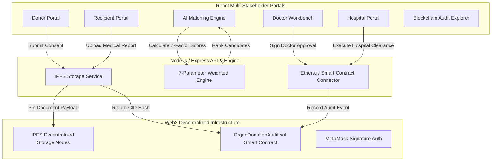

# 🫀 OrganChain - Decentralized Organ Donor & Recipient Matcher

> **A Complete Web3 Application integrating Ethereum Smart Contracts, Off-Chain IPFS Document Storage, Node.js REST API, 7-Parameter Weighted Matching Engine, and Multi-Stakeholder React Portals.**

---

## 🌟 Overview

**OrganChain** is a decentralized organ donation and recipient compatibility matching system designed to eliminate waitlist opacity, ensure immutable consent management, enforce multi-hospital dual clearance, and maintain a tamper-proof blockchain audit trail.

---

## 🏗 Key Features & Architecture



### 1. Smart Contracts (`OrganDonationAudit.sol`)
- Written in **Solidity 0.8.20** and compiled with Hardhat (`viaIR: true`).
- Deployed to Hardhat local EVM (`0x5FbDB2315678afecb367f032d93F642f64180aa3`).
- Handles donor consent pledges, recipient medical report IPFS CIDs, doctor approvals, hospital clearances, and immutable block audit logs.

### 2. Weighted Matching Engine (7 Specification Parameters)
Evaluates recipient candidates on a **0 to 100%** index based on:
1. **Blood Group Compatibility (25%)**: Compatible ABO/Rh pairs (O universal donor, A, B, AB matrix).
2. **Organ Type Match (20%)**: Strict organ demand vs harvest match.
3. **Organ Availability (15%)**: Cold ischemia freshness decay model.
4. **Age Discrepancy (10%)**: Minimizes donor-recipient age delta.
5. **HLA Tissue Compatibility (10%)**: 6-locus tissue antigen matching (HLA-A, B, DR).
6. **Medical Urgency (10%)**: Emergency status priority (Status 1A Critical to Status 2).
7. **Waiting List Duration (10%)**: Priority boost based on time elapsed on waiting list.

### 3. IPFS Off-Chain Storage
- Securely stores medical diagnostic reports and organ consent forms off-chain.
- Returns deterministic **IPFS CIDs** (`Qm...`) and SHA-256 digests pinned to the smart contract ledger.

### 4. Interactive Multi-Stakeholder UI
- **User (Donor/Recipient)**: Pledge organ consent, submit medical reports to IPFS.
- **Doctor Workbench**: Inspect patient IPFS medical reports, examine 7-score breakdowns, and sign doctor approvals.
- **Hospital Clearance**: Harvest organ listings, verify doctor sign-offs, execute hospital clearances, and broadcast transplant execution blocks.
- **System Admin**: Searchable real-time blockchain ledger stream with tx hashes, block height, and node health metrics.

---

## 🛠 Tech Stack

| Layer | Technologies |
|---|---|
| **Frontend** | React, Vite, TailwindCSS, Lucide Icons, Ethers.js |
| **Backend** | Node.js, Express, Mongoose / In-Memory Store, JWT |
| **Blockchain** | Solidity, Hardhat, Ethers.js |
| **Storage** | IPFS (Pinata / Hash Vault), SHA-256 Checksums |
| **Wallet** | MetaMask Web3 Integration |

---

## ⚡ Getting Started

### Prerequisites
- Node.js (v18+ or v20+)
- npm or yarn

### Installation & Setup

1. **Clone the Repository**
   ```bash
   git clone https://github.com/harshpjain77-design/organ-donation.git
   cd organ-donation
   ```

2. **Install Root & Sub-directory Dependencies**
   ```bash
   npm install
   cd backend && npm install
   cd ../frontend && npm install
   cd ..
   ```

3. **Compile & Deploy Smart Contract**
   ```bash
   npm run compile
   node scripts/deploy.js
   ```

4. **Start the Backend API Server**
   ```bash
   cd backend
   npm run start
   ```
   *Runs at `http://localhost:5000`*

5. **Start the Frontend Application**
   ```bash
   cd frontend
   npm run dev
   ```
   *Runs at `http://localhost:3000`*

---

## 📜 License

MIT License. Built for Decentralized Healthcare & Organ Transplantation Management.
